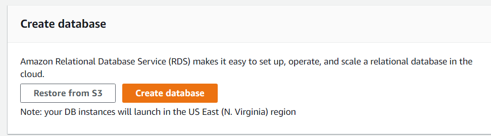
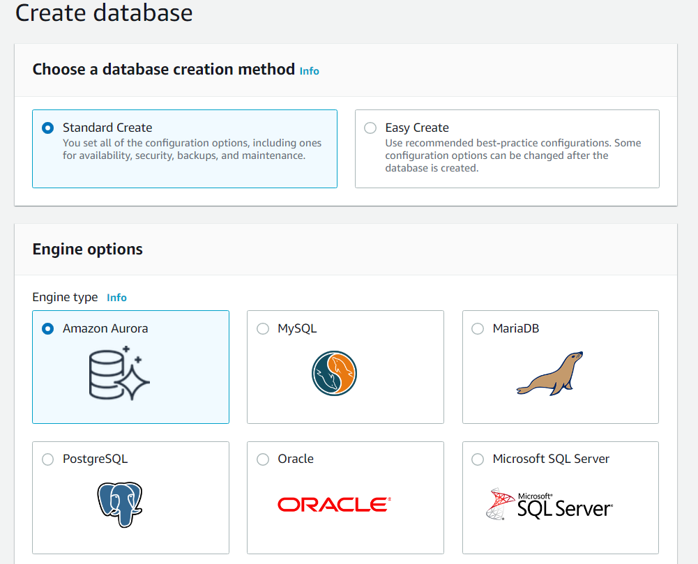
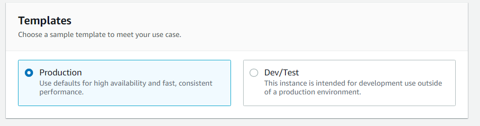
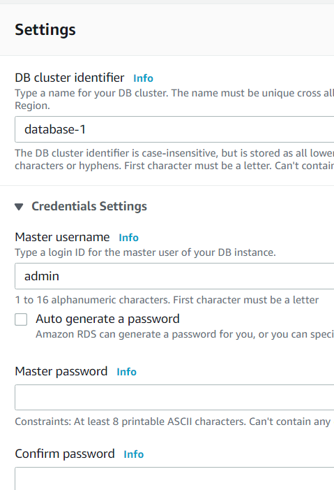
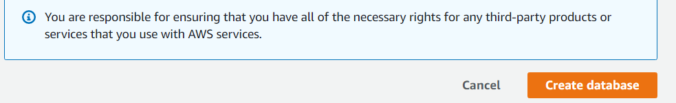

#RDS
---

Relational Database Service is one of the *Amazone Web Service*.
It is a web service running "in the cloud" designed to simplify the setup , operation, and scaling of a relational database.
  
---
**Steps to create RDS Database instance** 

 1.Sign in to AWS Console and open Amazone RDS Console.

 2.In the upper-right corner of the AWS Management Console, choose the AWS region in which you want to create the DB instance. 
   
 3.In navigation pane choose **Database**.

 4.Chosse **Create database**.
   

 5.On the **Create database** page, shown following, select **Standard Create** option which will allow you to select all the settings
   as per your need or choose **Easy Create** where AWS will give you some of the options by default selected.
    
    
 6.In **Engine Options** choose the the engine you want to create database of.

 7.In the **Templete** section , choose **Dev/Test**.
     

 8.In **Settings** section, set these values:
    
 
  * **DB instance identifier** - `give name to your db`
      
  * **Master Username** - `give username`
      
  * **Auto generate a password** - Dissable the option
      
  * **Master password** - Create a password
      
  * **Confirm password** - Retype the password

 9.In the **storage** and **Availablity & Durablity** sections, use the default values.

 10.In **Connectivity** section open **Aditional connectivity configuration** and set the values as per your need
       **public access** -> yes
       **Database ports** -> mostly kepp default.
       
 11. After selecting all the options needed hit **Create database** . This will create your RDS in AWS.
   
